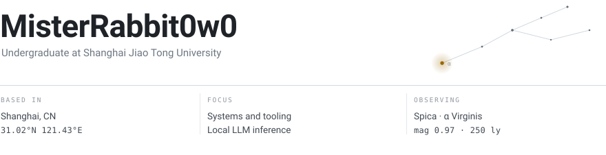
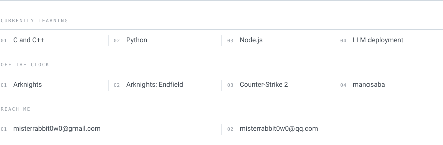

<picture>
  <source media="(prefers-color-scheme: dark)" srcset="./assets/header-dark.svg" />
  
</picture>

Most of my time goes into C/C++ and Python — systems work, small tools, and running
language models locally rather than through someone else's API. When the sky is clear,
I spend it looking up instead.

<picture>
  <source media="(prefers-color-scheme: dark)" srcset="./assets/panel-dark.svg" />
  
</picture>

 

<picture>
  <source media="(prefers-color-scheme: dark)" srcset="https://github-readme-stats-psi-gilt-58.vercel.app/api?username=MisterRabbit0w0&show_icons=true&hide_title=true&hide_rank=true&hide_border=true&disable_animations=true&include_all_commits=true&count_private=true&card_width=400&bg_color=00000000&text_color=b9c1ca&icon_color=636c76" />
  
</picture>
<picture>
  <source media="(prefers-color-scheme: dark)" srcset="https://github-readme-stats-psi-gilt-58.vercel.app/api/top-langs/?username=MisterRabbit0w0&layout=compact&langs_count=8&hide_title=true&hide_border=true&disable_animations=true&card_width=400&bg_color=00000000&text_color=b9c1ca" />
  
</picture>
